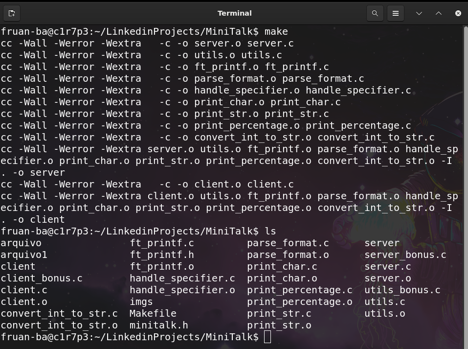
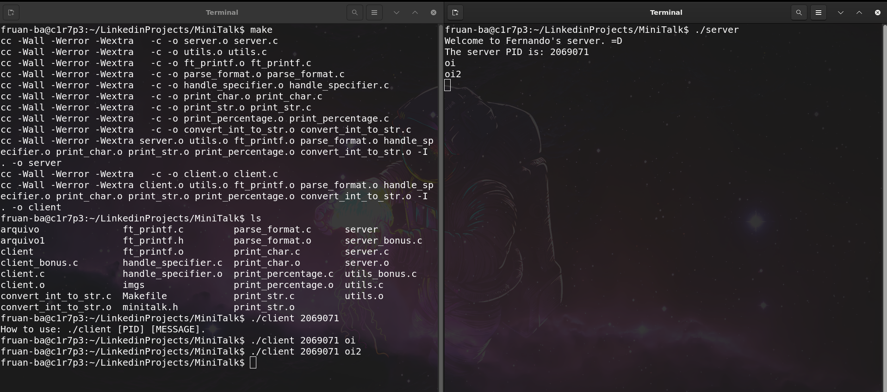

<h1 style="text-align: center;">MiniTalk</h1>


## About the Project

O projeto **MiniTalk** trata-se de um estudo sobre a comunicação entre processos. O objetivo é criar um programa que será um **cliente** e outro um **servidor**. O **cliente** enviará uma mensagem ao **servidor** que a irá armazenar e, assim que detectar o seu final, a printará completamente na saída padrão (**stdout**) para exibição. Parece algo bem simples, mas não é, cada byte de caracter (seus 8 bits) será enviado binário por binário ao servidor, que os organizará e descobrirá qual foi o caracter que você montou (pensando na tabela **ASCII**).

Vamos a um exemplo básico. Se eu quiser enviar a mensagem `"Oi"`, cada caracter será enviado separadamente bit por bit. Nesse caso, teremos, `24 bits`. Como assim, 24 bits??? Se temos dois caracteres, 8 mais 8 é 16. Sim, isso está correto, mas como o servidor saberá que a mensagem foi concluída? Para isso, precisamos enviar um novo caracter que trata-se do caracter nulo, o clássico `\0`, que é representado por `00000000`, ou seja, **8 bits**.

O caracter `O`, maiúsculo, é representado como `01001111` e o
caracter `i`, minúsculo, é representado como `01101001`. Logo, farei esses envios e o servidor irá efetuar o armazenamento, tudo certo? Primeiro, como eu posso realizar esse envio? Por meio de sinais. Como? Em Linux, temos diversos sinais para a comunicação com os processos ativos no sistema. Por exemplo, o **SIGTERM**, encerra um processo de forma graciosa, o **SIGSTOP** coloca um processo em background, o **SIGKILL** mata o processo a força, o **SIGINT** manda o processo ser encerrado assim como o **SIGQUIT**, mas, sua funcionalidade pode ser capturada e alterada pelos programas, diferente do **SIGKILL**. No caso em questão, eu quero um sinal para que eu possa usar como indicador para os binários **1** e **0**. Para isso, o Linux nos disponibiliza o `SIGUSR1` e `SIGUSR2` como sinais totalmente personalizáveis pelo programador. Não preciso, obrigatoriamente usar o primeiro informado como **1** e o outro para ser **0**, tenho essa liberdade de escolha.

E agora? É só isso? Se for, é um programa muito bem simples, correto? Infelizmente, não é somente isso. Durante testes realizados na montagem do projeto **MiniTalk**, cheguei a descoberta de que o **cliente** pode enviar cada bit em uma velocidade maior do que o que o **servidor** possa coletar e armazenar corretamente ou o primeiro pode enviar a uma velocidade de um caracol, atrasando imensamente a formação da mensagem e exibição. Nesse sentido? Como resolver esse problema? Testando limites, dando pausas, forçando aguardar mais, tinha conseguido uma maior estabilidade, mas isso não foi suficiente. Ou seja, para resolver definitivamente eu precisava que o cliente e servidor se comunicassem e fornecessem uma espécie de **handshake** (aperto de mão). Como assim? O **servidor** avisa ao **cliente** quando ele está disponível para que ele envie o próximo bit, logo o programa que envia os bits, manda apenas o primeiro, aguarda, recebe um sinal e continua o envio. Dessa forma, a mensagem chegará íntegra, sem ser corrompida durante o próprio processo de comunicação. Após enviar todos os caracteres, nosso receptor envia um sinal para o encerramento do loop de envio do cliente, a confirmação final.

Enfim, consegui mostrar um pouco da ideia do programa **MiniTalk** com minhas próprias palavras?

## How to use

Afinal de contas, dei muita teoria e agora desejo ver o programa sendo executado. Como posso fazer isso??? O primeiro passo é realizar a compilação dos programas dando um simples comando:

```bash
make
```
Com isso, os dois programas serão compilados. Após isso, abra dois terminais, nosso clássico, shell, prompt de comando:

<html>
<body>
<h2>Make</h2>

<h2>Using the Programs</h2>

</body>
</html>
